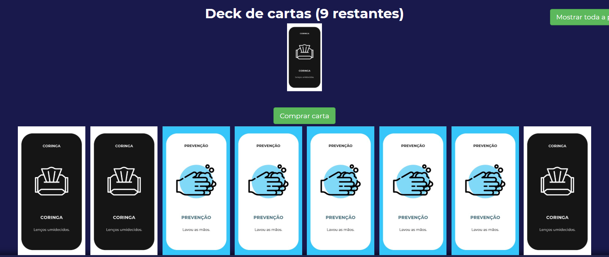

<h1 align="center">🦠 Xô, Corona!</h1>

Uma versão de Exploding Kittens no contexto do Coronavírus feita com Nodejs + Express + Socket.io.

### REGRAS
Baseando-se nas regras originais (http://www.explodingkittens.com/how), o Xô Corona funciona da seguinte maneira:

#### Efeitos das cartas
* **Ataque**: Faz com que o próximo jogador compre uma carta extra durante a sua rodada.
* **Cancelamento**: Cancela o efeito da última carta jogada. Sempre que for possível utilizá-la, a interface exibirá um botão de ação.
* **Contaminação**: Infectará o jogador que encontrar a carta a menos que o mesmo possua uma carta de Prevenção.
* **Coringa**: Somente podem ser descartados em pares. Ao fazer, o jogador que descartou deve pegar uma carta aleatória da mão de qualquer jogador.
* **Embaralhar**: Embaralha o deck de cartas.
* **Favor**: Pede uma carta para qualquer jogador escolhido, a carta dada será de escolha do mesmo.
* **Prevenção**: Salvará o jogador que a possuir caso o mesmo encontre uma carta de contaminação.
* **Prever**: Mostrará ao jogador que a utilizou as primeiras 3 cartas no topo do deck. É uma ação que pode ser anulada pela carta de Cancelamento.
* **Pular**: Faz com que o jogador termine o seu turno sem precisar comprar uma carta do deck.

### COLABORADORES

| [ @tekpixo](https://github.com/tekpixo) |
| :---: |    

### CRÉDITOS
* Jogo de cartas original: http://www.explodingkittens.com/
* Jogo base: https://github.com/Mikunj/Exploding-Ketchup
