<h1 align="center">🦠 Xô, Corona!</h1>

  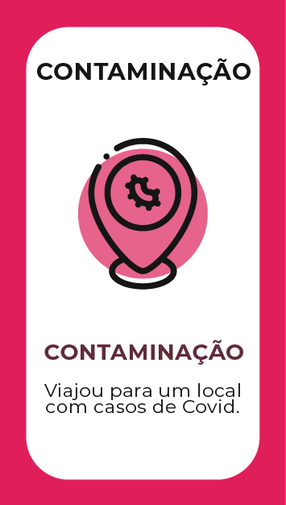
  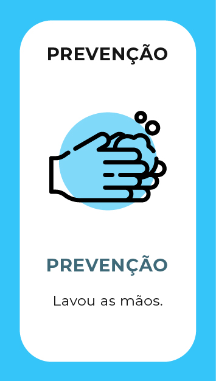
  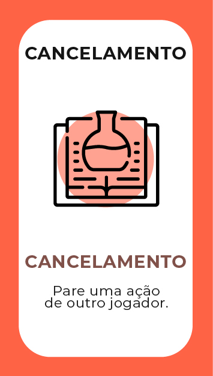
  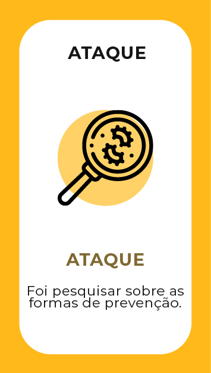
  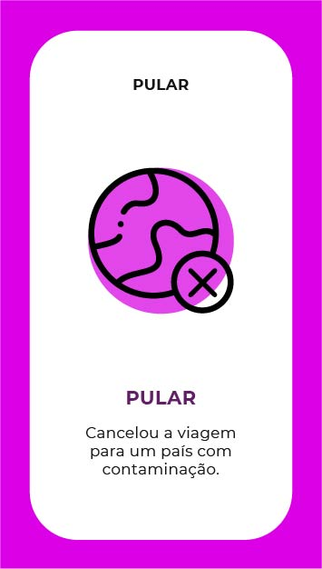
  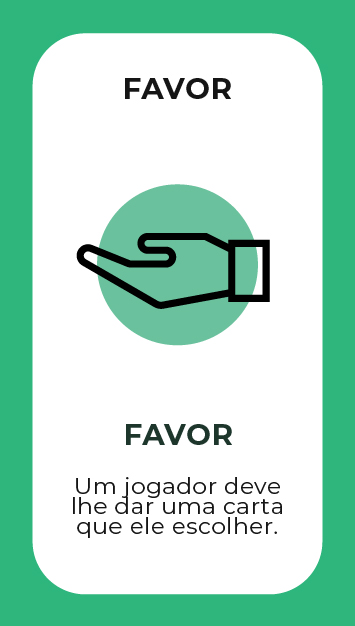
  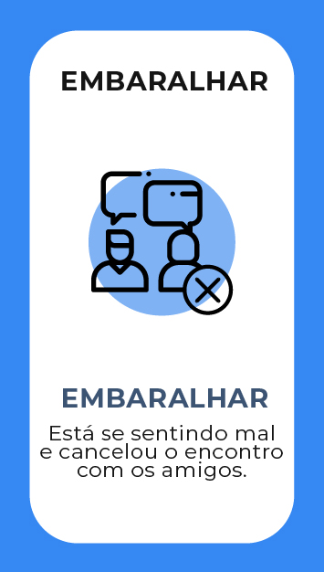
  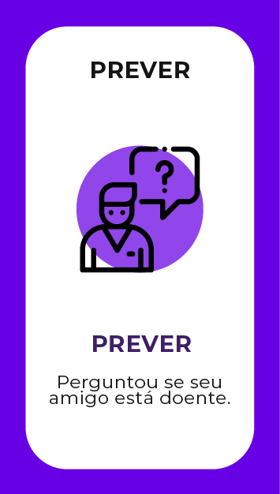
  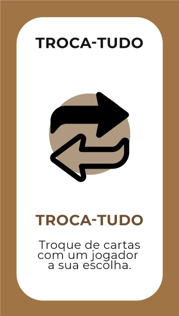
  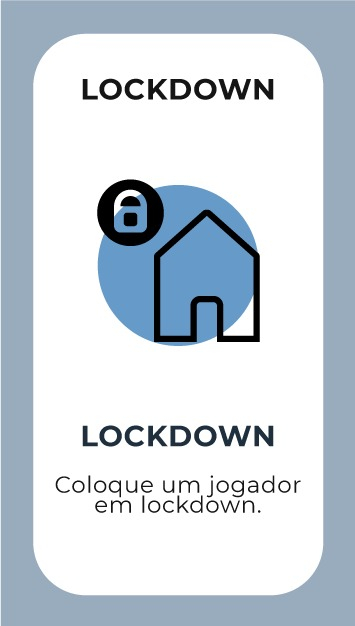
  
  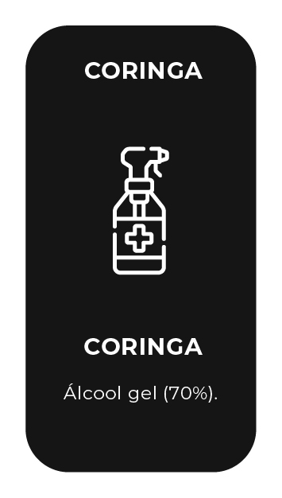
  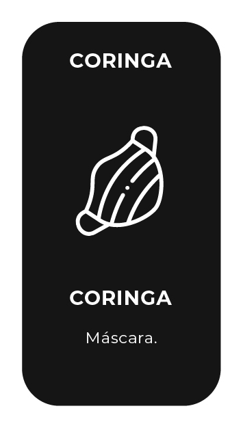
  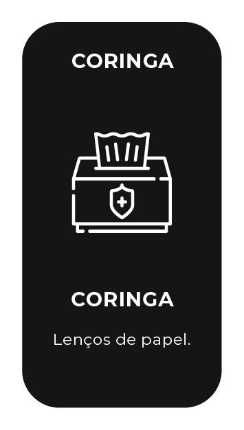
  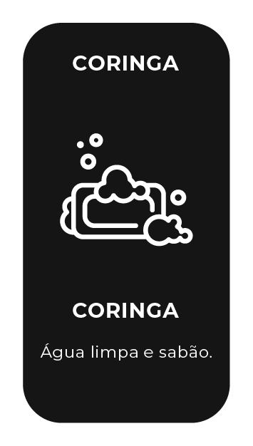

## REGRAS

Baseando-se nas regras originais (http://www.explodingkittens.com/how), o Xô Corona funciona da seguinte maneira:

### COMO FUNCIONA

Há algumas cartas de Contaminação (covid-19) no meio do baralho. Os jogadores se revezam comprando cartas do baralho virado para baixo até que alguém compre uma Contaminação. Quando isso acontecer, a pessoa é infectada e é eliminada do jogo. Isso continua até que reste somente 1 jogador, que será o vencedor. Quanto mais cartas você comprar, mais chances tem de comprar uma Contaminação.

**RESUMINDO**: Se você for contaminado, você perde. Se você não for contaminado, você vence. E todas as outras cartas do baralho vão ajudar você a não ser eliminado pela contaminação.

### PREPARAÇÃO

No início de cada partida todos os jogadores recebem 5 cartas e o deck é embaralhado. Conforme dito anteriormente, você precisa evitar cartas de Contaminação, porém caso compre uma e possua uma carta de Prevenção, a Contaminação retornará para a Pilha de Compra em um local aleatório e a carta de Prevenção será descartada. O criador da sala será o primeiro jogador a jogar.

### NA SUA VEZ DE JOGAR

Olhe para todas as cartas na sua mão e faça uma das seguintes ações:

**PASSE A VEZ** ao não jogar nenhuma carta e comprar uma carta da Pilha de Compra **OU JOGUE** descartando uma carta e seguindo as instruções dela. Após aplicar o efeito da carta, termine o seu turno ou jogue outra carta de efeito. Jogue quantas cartas quiser. **SEMPRE** termine o seu turno comprando a carta do topo da Pilha de Compra. Torça para não pegar uma Contaminação! __Xô Corona é diferente da maioria dos jogos onde você COMEÇA O SEU TURNO ao comprar uma carta.__

### FIM DO JOGO

Vence o jogo o último jogador que não for contaminado. As cartas na Pilha de Compra nunca acabarão porque sempre existirão cartas de Contaminação suficientes para infectar todos os jogadores, exceto um.

### MAIS ALGUMAS COISINHAS

* É uma boa estratégia guardar as suas cartas no início da partida, enquanto as suas chances de explodir são mais baixas (já que todos os jogadores iniciam o jogo com uma carta de Prevenção em sua mão).
* É possível contar as cartas que ainda restam na Pilha de Compra para saber a probabilidade de você explodir.
* Não há um máximo e nem um mínimo de cartas que você pode ter na mão. Se as cartas da sua mão acabarem, não há nenhuma ação especial a ser feita. Continue jogando. Você comprará pelo menos mais 1 carta na sua próxima rodada.

### EFEITOS DAS CARTAS

* **Ataque**: Faz com que o próximo jogador compre uma carta extra durante a sua rodada e isenta o aplicante do efeito de comprar uma carta ao final do turno.
* **Cancelamento**: Cancela o efeito da última carta jogada. Sempre que for possível utilizá-la, a interface exibirá um botão de ação.
* **Contaminação**: Infectará o jogador que encontrar a carta a menos que o mesmo possua uma carta de Prevenção.
* **Coringa**: Apesar do nome, não têm nada de especial e somente podem ser descartados em pares. Ao fazer, o jogador que descartou deve pegar uma carta aleatória da mão de qualquer adversário a sua escolha.
* **Embaralhar**: Embaralha o deck de cartas.
* **Fake News:** Informações falsas são problemáticas! Fake News são muito parecidas com cartas de Prevenção porém elas não te salvarão de uma Contaminação. Ao encontrá-la, você pode descartá-la para receber uma Prevenção de verdade. 
* **Favor**: Pede uma carta para qualquer jogador escolhido, a carta dada será de escolha do mesmo. É uma ação que pode ser anulada pela carta de Cancelamento.
* **Lockdown:** Selecione um jogador para ficar em isolamento por uma rodada. Esse jogador só poderá comprar cartas na sua vez.
* **Prevenção**: Salvará o jogador que a possuir caso o mesmo encontre uma carta de contaminação.
* **Prever**: Mostrará ao jogador que a utilizou as primeiras 3 cartas no topo do deck. É uma ação que pode ser anulada pela carta de Cancelamento.
* **Pular**: Faz com que o jogador termine o seu turno sem precisar comprar uma carta do deck. É uma ação que pode ser anulada pela carta de Cancelamento.
* **Troca-tudo:** CUIDADO! Ao usar essa carta, você troca todas as cartas da sua mão com um adversário a sua escolha.

### COMBOS MANEIROS

**DUAS CARTAS IGUAIS**: Jogar pares de cartas iguais não se aplica somente às cartas Coringa (em que você pode roubar uma carta aleatória de
outro jogador), e sim a QUAISQUER cartas de mesmo nome (um par de Cartas de Embaralhar, um par de Cartas de Pular, etc).

**TRÊS CARTAS IGUAIS**: Funciona exatamente da mesma forma que o combo de Duas Cartas Iguais, com a diferença que você poderá escolher um tipo de carta que gostaria de pegar do outro jogador. Caso ele tenha uma carta desse tipo, você fica com ela. Se ele não tiver, você não recebe nenhuma.

<h1 align="center">Gostou? Entendeu tudo? ENTÃO PARE DE LER E VÁ JOGAR!</h1>

### COLABORADORES

| [ Lincoln Costa](https://github.com/tekpixo) | [ Joshua Kritz](https://github.com/HuntedSouls) | [ Tadeu Classe](https://github.com/tadeu28) | 
| :---: | :---: | :---: |

----

### CRÉDITOS

* Jogo de cartas original: http://www.explodingkittens.com/
* Jogo base: https://github.com/Mikunj/Exploding-Ketchup

### LICENÇA

Esse programa é um software livre: você pode redistribuí-lo e/ou modificá-lo sob os termos da Licença Pública Geral GNU publicada pela Fundação de Software Livre, seja na versão 3 da Licença, ou (caso deseje) qualquer versão posterior.

Esse programa é distribuído na esperança que seja útil, mas SEM QUALQUER GARANTIA; inclusive sem a garantia de comercialização ou funcionamento para um propósito específico. Veja a Licença Pública Geral GNU para mais detalhes.

Você deve ter recebido uma cópia da Licença Pública Geral GNU ao receber esse programa. Caso não tenha recebido, acesse http://www.gnu.org/licenses/.
